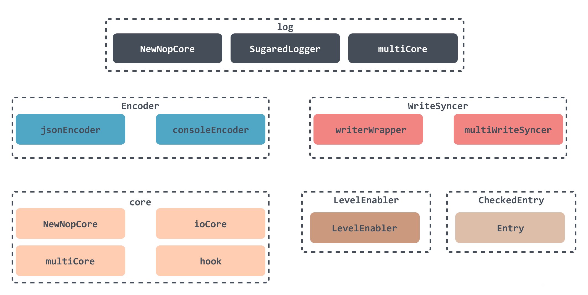

## 高性能Go日志库zap的设计与实现

### 前言

一般开发RPC服务或者Web服务器，都会使用到日志，用于记录服务运行过程中的一些错误信息及性能问题，有时候还会记录一些关键访问信息，用于后续的系统审计。

Go提供的日志库挺多的，包括内置的log库，以及github上star数较多的zerolog、go-kit、logrus、apex/log、zap等。每个库都有自己的特色，部分库的调用方式差别也比较大，需要根据实际情况去选择。如果从性能方面考虑的话，一般会选用zap进行日志记录。

下表是zap官方给的基准测试情况，可以看出，在记录一个包含10个字段的消息的情况下，**zap的性能是其它日志库的3～10倍**。

| Package         | Time        | Time % to zap | Objects Allocated |
| --------------- | ----------- | ------------- | ----------------- |
| ⚡ zap           | 2900 ns/op  | +0%           | 5 allocs/op       |
| ⚡ zap (sugared) | 3475 ns/op  | +20%          | 10 allocs/op      |
| zerolog         | 10639 ns/op | +267%         | 32 allocs/op      |
| go-kit          | 14434 ns/op | +398%         | 59 allocs/op      |
| logrus          | 17104 ns/op | +490%         | 81 allocs/op      |
| apex/log        | 32424 ns/op | +1018%        | 66 allocs/op      |
| log15           | 33579 ns/op | +1058%        | 76 allocs/op      |

本文从zap的源码出发，来说明它是如何实现的，为何比其它日志库性能更优。

### zap设计

#### 日志初始化

我们可以通过官方的例子来了解一下zap的内部组件。

```go
log := zap.NewExample()
```

NewExample 函数返回了一个由 NewCore 创建的 Core 结构，它是 zap 的核心结构。

对于日志库，有三个主要的问题：

1. 输入数据是如何序列化的；
2. 序列化之后在哪里存储输入数据，是控制台还是文件，又或者其他地方；
3. 日志记录的级别，是debug、info，还是error。

zap中使用NewCore创建Core结构时需要传递的三个参数正好对应上述三个问题：输入数据的Encoder，日志数据的WriteSyncer，日志级别的LevelEnabler。

除了 NewExample 构造函数之外，zap 还提供了 NewProduction 和 NewDevelopment 来构造日志实例。

```go
log, _  = zap.NewProduction()
log, _  = zap.NewDevelopment()
```

这两个函数通过构造一个 Config 结构然后调用 Build 方法来创建 NewCore 所需的参数，最后实例化得到log实例。


#### 日志数据输出

初始化完成之后，你可以使用Info、Debug、Error方法来打印日志：

```go
    log  = zap.NewExample()
    url := "http://example.org/api"
    log.Info("failed to fetch URL",
        zap.String("url", url),
        zap.Int("attempt", 3),
        zap.Duration("backoff", time.Hour),
    )
```

zap打印日志流程如下：

1. 首先检查 logging 配置级别，若配置级别大于当前输出级别，则不会输出本条日志；
2. 将日志数据封装到一个 Entry 实例中；
3. 将多个core添加到 CheckedEntry 实例；
4. 遍历 CheckedEntry 实例中的Core：
   1. 根据Core中的Encoder将日志数据序列化到Buffer中；
   2. 使用WriteSyncer从Buffer中读取日志数据并输出。

#### 接口和框架设计



代码结构采用简单的接口封装设计，实现多种风格的配置组合，满足各种需求。最上层实现了三个用于实现不同功能的日志：

1. **Logger**：使用比较麻烦，只能使用结构化输出，但性能更好；

2. **SugaredLogger**：可以使用Printf输出日志，性能比Logger差40%左右；

3. **zapgrpc**：用于grpc日志输出。

Logger在设计上很容易转换为SugaredLogger和zapgrpc；这三种在创建对象时都需要传递一个Core接口的实现实例。


**Core接口**：zap提供了Core接口的多种实现：NewNopCore、ioCore、multiCore、hook。

最常用的是ioCore、multiCore，从名字就可以看出multiCore是一个可以包含多个ioCore的结构，比方说，你可以为Error类日志设置一种日志格式及存储方式（控制台、文件...），为Info类设置另外一种日志格式及存储方式。

如前所述，Core实现类ioCore需要传入三个对象：Encoder，输入数据的编码器；WriteSyncer，日志数据的存储方式；LevelEnabler，日志级别。

**Encoder接口**：zap提供了consoleEncoder、jsonEncoder的实现，分别用于控制台格式和 JSON 格式的日志输出，这些Encoder都有自己的序列化实现，可以更快地格式数据。

**EncoderConfig**：上面介绍的Encoder也允许用户根据EncoderConfig灵活配置日志输出格式，包括日志消息的键名、日志级别名、时间输出格式、方法名等。

**WriteSyncer接口**：zap提供了writerWrapper的单个日志输出实现以及可以将日志输出到多个位置的multiWriteSyncer实现。

**Entry**：配置完成后，zap会将要写入的日志数据封装成一个个Entry，其中包含日志名称、日志时间、日志级别，以及日志数据信息，没有Field信息，然后使用Core的Check方法生成CheckedEntry实例。

**CheckedEntry**：包含了关于日志数据的所有信息，包括上述的Entry、调用栈信息等。

#### 性能

##### 使用pool

**zap使用sync.Pool重用了大量的对象**。它在实例化CheckedEntry、Buffer、Encoder等对象时，会直接从对象池中获取，而不是实例化一个新的，这样复用对象可以减少GC的压力，减少内存分配。

##### 避免反射

如果我们使用官方的日志库，输出日志的方式是这样的：

```go
log.Printf("%s login, age:%d", "luoluo", 19)
```

log.Printf函数实际上是调用该`fmt.Sprintf`函数来格式化输出的日志数据：

```go
func Printf(format string, v ...interface{}) {
    std.Output(2, fmt.Sprintf(format, v...))
}
```

查看源码可以发现，fmt.Sprintf效率是比较低的：

1. `fmt.Sprintf`接受的类型是interface{}，内部使用反射。
2. `fmt.Sprintf`用于格式化字符串，需要解析格式字符串，如`%s`，`%d`等，增加了解析时间。

但是在zap中，使用了内置的Encoder，通过内部的Buffer将日志数据拼接成字节形式，减少了反射带来的性能损失；而且zap使用结构化日志，不需要解析`%s`、`%d`等标识符，这也提升了性能。

##### 更高效灵活的序列化实现

zap提供的两个序列化实现都可以根据传入的EncoderConfig灵活配置。这种灵活的配置不仅仅是日志输出key的名称，它还支持在EncoderConfig中传入一个函数来调用用户自定义的Encoder实现。

很多日志库使用的序列化工具是内置的json库，效率较低。

### zap代码分析

由于感觉zap代码写的比较优雅，这里稍微分析一下源码。

#### 初始化

##### 初始化Core

上文讲过，Core有4个实现类，我们以最常用的ioCore为例进行说明。

ioCore 非常简单，总共需要三个字段：Encoder 用于输入数据，WriteSyncer 用于设置日志数据存储方式，LevelEnabler 用于设置日志级别：

```go
type ioCore struct {
    LevelEnabler
    enc Encoder
    out WriteSyncer
}
```

NewCore函数在用于创建ioCore时也会返回一个对象指针：

```go
func NewCore(enc Encoder, ws WriteSyncer, enab LevelEnabler) Core {
    return &ioCore{
        LevelEnabler: enab,
        enc:          enc,
        out:          ws,
    }
}
```

##### 初始化Logger

zap使用New函数实例化一个 Logger：

```go
func New(core zapcore.Core, options ...Option) *Logger {
    if core == nil {
        return NewNop()
    }
    log := &Logger{
        core:        core,
        errorOutput: zapcore.Lock(os.Stderr),
        addStack:    zapcore.FatalLevel + 1,
        clock:       _systemClock,
    }
    return log.WithOptions(options...)
}
```

New函数设置相应的默认字段，包括Core实例、错误日志输出位置、堆栈日志的输出级别、日志时间等，然后实例化一个Logger对象并返回对象指针。

Logger结构的信息如下：

```go
type Logger struct {
    core zapcore.Core
    // 是否是开发模式
    development bool
    // 是否打印行号
    addCaller   bool
    onFatal     zapcore.CheckWriteAction // default is WriteThenFatal

    name        string
    // 错误日志输出
    errorOutput zapcore.WriteSyncer
    // 输出调用堆栈
    addStack zapcore.LevelEnabler
    // 打印调用者的行号
    callerSkip int

    clock Clock
}
```

Logger结构中包含很多配置信息，我们使用时可以通过WithOptions添加相应的参数。例如，添加日志行号。

```go
log := zap.New(core).WithOptions(zap.AddCaller())
```

AddCaller 函数创建了一个回调钩子供 WithOptions 执行。

```go
func (log *Logger) WithOptions(opts ...Option) *Logger {
    c := log.clone()
    for _, opt := range opts {
    // 调用 Option 接口的方法 
        opt.apply(c)
    }
    return c
}
```

你可以传入一个Options数组给WithOptions，它会遍历数组并调用apply方法。

```go
type optionFunc func(*Logger)

func (f optionFunc) apply(log *Logger) {
    f(log)
}
// 定义 Option 接口
type Option interface {
    apply(*Logger)
}

func AddCaller() Option {
  // 返回 Option
    return WithCaller(true)
}

func WithCaller(enabled bool) Option {
  // 将 func 强转成 optionFunc 类型
    return optionFunc(func(log *Logger) {
        log.addCaller = enabled
    })
}
```

这里的代码定义了一种函数类型。在 go 中，函数也是一种类型，和结构一样，它可以有方法。

这里的optionFunc是实现apply方法的函数类型，所以相当于继承了Option接口。在WithCaller中，使用optionFunc将一个函数包裹起来，看起来很神奇，但实际上这和int64(123)没有什么区别。

在WithOptions函数中，将WithCaller返回的函数转换为optionFunc传递给log执行，相当于改变log的addCaller属性。

#### 日志打印

打印日志的整个过程如下：


1. 首先，获取CheckedEntry实例并封装对应的日志数据；
2. 然后，使用Core中封装的编码器对其进行编码，并将编码后的内容放入缓冲区。
3. 最后，将缓冲区的内容输出到Core中封装的WriteSyncer。

我们初始化Logger之后，就可以使用它调用相应的Info、Warn、Error等方法来打印日志输出。由于所有日志级别的输出方式都是一样的，这里我们通过Info方法进行分析。

该方法首先调用 check 方法来检查当前日志数据是否应该在配置的日志级别打印。

```go
func (log *Logger) Info(msg string, fields ...Field) {
    // 检查该日志是否应该被打印
    if ce := log.check(InfoLevel, msg); ce != nil {
        // 打印日志
        ce.Write(fields...)
    }
}
```

对于 Info 日志级别，传入 InfoLevel，对于 Error 日志级别，传入 ErrorLevel。zap 日志级别由这些常量定义。

```go
type Level int8

const ( 
    DebugLevel Level = iota - 1 
    InfoLevel 
    WarnLevel 
    ErrorLevel 
    DPanicLevel 
    PanicLevel 
    FatalLevel

    _minLevel = DebugLevel
    _maxLevel = FatalLevel
)
```

最小的级别为DebugLevel，从 -1 开始。

##### check

```go
func (log *Logger) check(lvl zapcore.Level, msg string) *zapcore.CheckedEntry { 
    const callerSkipOffset = 2
    // 判断传入的日志等级是否应该打印
    if lvl < zapcore.DPanicLevel && !log.core.Enabled(lvl) {
        return nil
    }

    // 将日志数据封装成一个 Entry
    ent := zapcore.Entry{
        LoggerName: log.name,
        Time:       log.clock.Now(),
        Level:      lvl,
        Message:    msg,
    }
    //如果能写日志则返回一个 CheckedEntry 实例指针
    ce := log.core.Check(ent, nil)
    willWrite := ce != nil 
    ... 
    if !willWrite {
        return ce
    }

    ce.ErrorOutput = log.errorOutput
    // 判断是否打印调用行号
    if log.addCaller {
        // 获取调用者的栈帧
        frame, defined := getCallerFrame(log.callerSkip + callerSkipOffset)
        if !defined {
            fmt.Fprintf(log.errorOutput, "%v Logger.check error: failed to get caller\n", ent.Time.UTC())
            log.errorOutput.Sync()
        }
        // 设值调用者 entry
        ce.Entry.Caller = zapcore.EntryCaller{
            Defined:  defined,
            PC:       frame.PC,
            File:     frame.File,
            Line:     frame.Line,
            Function: frame.Function,
        }
    }
    if log.addStack.Enabled(ce.Entry.Level) {
        // 封装调用栈信息
        ce.Entry.Stack = StackSkip("", log.callerSkip+callerSkipOffset).String
    } 
    return ce
}
```

首先调用Core的Enabled方法来确定是否应该打印日志。由于日志级别实际上是int8类型，因此这是通过比较大小来直接确定。

```go
func (l Level) Enabled(lvl Level) bool {
    return lvl >= l
}
```

确定没有问题后，调用Check方法获取CheckedEntry实例指针。获取到CheckedEntry实例指针后，再根据配置信息设置值，然后返回。

这是获取 CheckedEntry 实例指针的方法。

```go
func (c *ioCore) Check(ent Entry, ce *CheckedEntry) *CheckedEntry {
    // 检查该 level 日志是否应该被打印
    if c.Enabled(ent.Level) {
        // 获取 CheckedEntry
        return ce.AddCore(ent, c)
    }
    return ce
}
```

AddCore方法也很简单，大家看看就明白了，不多说。

```go
var (
    _cePool = sync.Pool{New: func() interface{} {
        // Pre-allocate some space for cores.
        return &CheckedEntry{
            cores: make([]Core, 4),
        }
    }}
)

func (ce *CheckedEntry) AddCore(ent Entry, core Core) *CheckedEntry {
    if ce == nil {
        // 从 _cePool 里面获取 CheckedEntry 实例
        ce = getCheckedEntry()
        ce.Entry = ent
    }
    // 可能为 multi core ，需要 append 一下
    ce.cores = append(ce.cores, core)
    return ce
}

func getCheckedEntry() *CheckedEntry {
    // 从 pool 中获取对象
    ce := _cePool.Get().(*CheckedEntry)
    // 重置对象的属性
    ce.reset()
    return ce
}
```

##### write

```go
func (ce *CheckedEntry) Write(fields ...Field) {
    if ce == nil {
        return
    }
    ... 
    var err error
    // 遍历所有 core 写入日志数据
    for i := range ce.cores {
        err = multierr.Append(err, ce.cores[i].Write(ce.Entry, fields))
    }
    ...
    // 将 CheckedEntry 放回到缓存池中
    putCheckedEntry(ce)
    ...
}
```

这就是我们调用 core 的 Write 方法来写入日志数据的地方，下面为Core.Write的实现。

```go
func (c *ioCore) Write(ent Entry, fields []Field) error {
    // 调用 Encoder 的 EncodeEntry 方法对日志数据进行编码
    buf, err := c.enc.EncodeEntry(ent, fields)
    if err != nil {
        return err
    }
    // 将日志数据通过 WriteSyncer 写入
    _, err = c.out.Write(buf.Bytes())
    // 将buffer放回到缓存池中
    buf.Free()
    if err != nil {
        return err
    }
    if ent.Level > ErrorLevel {
        c.Sync()
    }
    return nil
}
```

Write 方法调用编码器的 EncodeEntry 方法。获取到数据后，调用WriteSyncer的Write方法写入日志数据。最后，将Buffer实例释放回缓存池。

### 总结

本文主要讲解zap的设计原理和代码实现。我们可以看到，zap被设计成可扩展性强的日志库，可以通过简单的方式进行配置，来实现丰富的功能。在性能方面，它通过使用sync.Pool来减少内存分配的开销，通过内置的高性能序列化方法来减少序列化的开销，并使用结构化数据来减少反射。总的来说，zap是个很优秀的开源库。