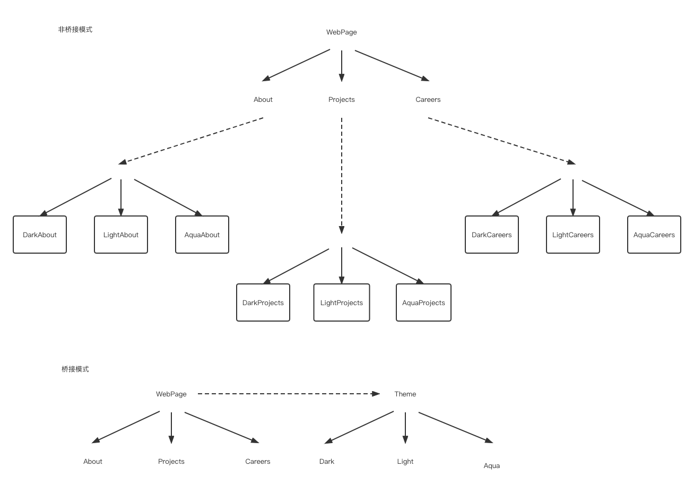

本文继续延续之前的“设计模式--结构型模式”“系列文章，讲解剩余的三个结构型模式：“桥接模式”、“组合模式”、“享元模式”。

### 桥接模式

#### 现实中的例子

> 试想您有一个包含不同页面的网站，您应该允许用户更改页面背景。你会怎么做？为每个背景、每个页面创建一个副本，还是只创建单独的背景并根据用户的偏好加载它们？桥接模式允许你通过第二种方式来实现需求

#### 待解决的问题/解决方案

当我们试图在多个独立的维度（上例中的页面和背景）上扩展程序时，可以通过将抽象与实现分离的方式解耦各个维度，以便其可以独立变化。

对应到上面的例子，实现方式如下：

#### 模式优缺点

##### 优点

- 客户端代码仅与高层抽象部分进行互动， 不会接触到平台的详细信息。
-  *开闭原则*。 你可以新增抽象部分和实现部分， 且它们之间不会相互影响。

##### 缺点

对高内聚的类使用该模式可能会让代码更加复杂。

#### Golang实践

参考[bridge](https://github.com/xwangli/wechatPublic/tree/main/code/golang/design_pattern/bridge)

### 组合模式

#### 现实中的例子

> 每个组织都是由员工组成的。每个员工都有相同的特征，例如有薪水，有工作责任，可能需要向某人汇报工作，可能有下属等。
>
> 当我们需要知道每个组织的每月的薪酬情况时，我们只需遍历组织下所有的员工，获取他们的薪资情况，然后相加即可。

#### 待解决的问题/解决方案

组合模式通过将对象“组合”成树结构的形式，来表示部分整体的层次结构。实现组合模式可以让客户以统一的方式来处理单个对象和组合。

#### 模式优缺点

##### 优点

- 可以利用多态和递归机制更方便地使用复杂树结构。
-  *开闭原则*。无需更改现有代码，就可以在应用中添加新元素，使其成为对象树的一部分。

##### 缺点

-  对于功能差异较大的类，提供公共接口或许会有困难。在特定情况下，需要过度一般化组件接口，这样的话会使代码变得令人难以理解。

#### Golang实践

参考[composite](https://github.com/xwangli/wechatPublic/tree/main/code/golang/design_pattern/composite)

### 享元模式

#### 现实中的例子

> 工厂生产杯子之类的都会一次性生产一批，而不是一个，因为生产过程中部分资源可以共享，节省成本。

#### 待解决的问题/解决方案

享元是一种通过与其他类似对象共享尽可能多的数据来最小化内存使用的方法，一般用在需要创建大量对象的场景下。

#### 模式优缺点

##### 优点

-  如果程序中有很多相似对象， 可以节省大量内存。

##### 缺点

- 可能需要牺牲执行速度来换取内存，因为他人每次调用享元方法时都需要重新计算部分情景数据。
-  代码会变得更加复杂。团队中的新成员总是会问： “为什么要像这样拆分一个实体的状态？”。

#### Golang实践

参考[flyweight](https://github.com/xwangli/wechatPublic/tree/main/code/golang/design_pattern/flyweight)